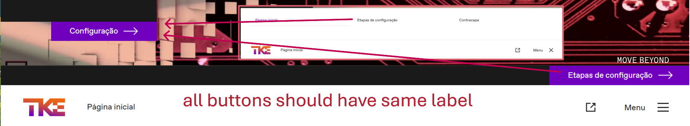
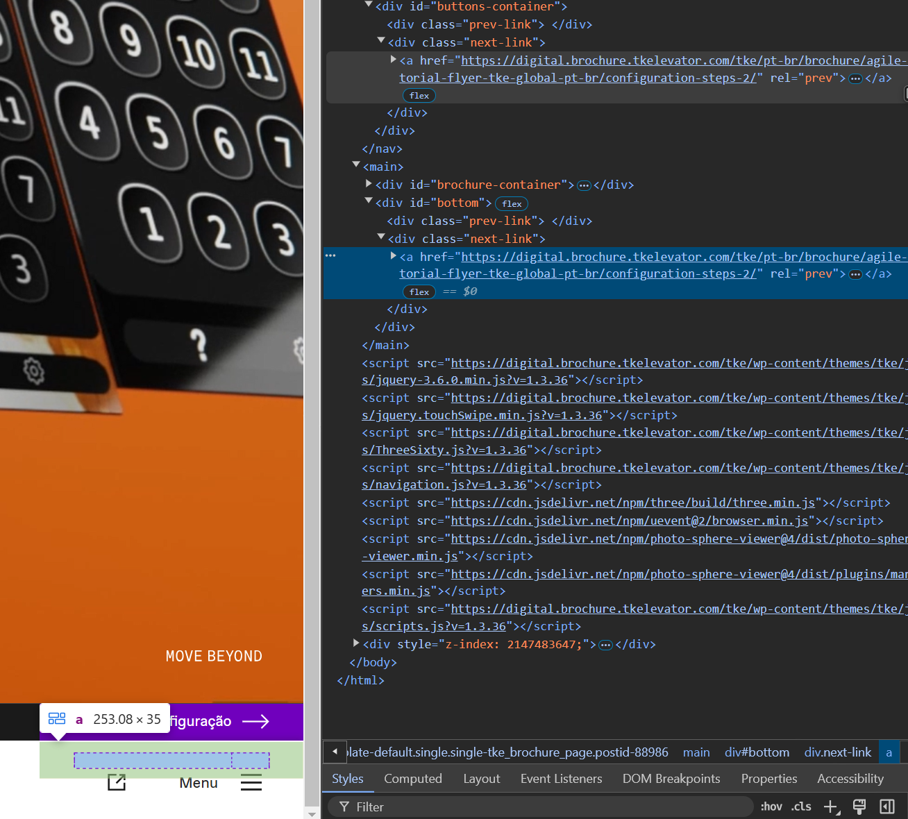
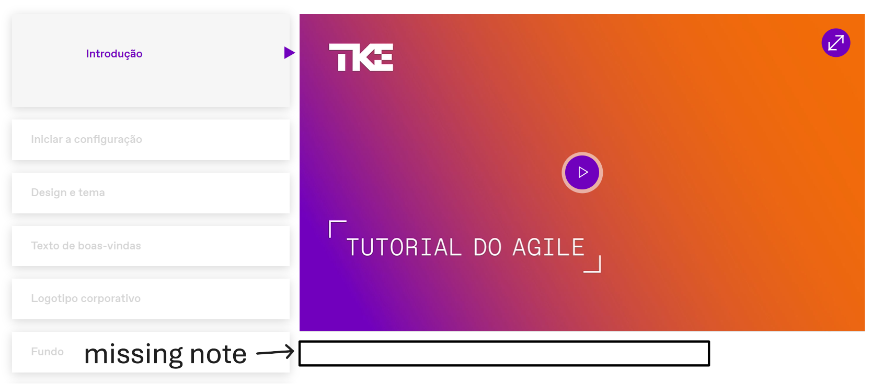
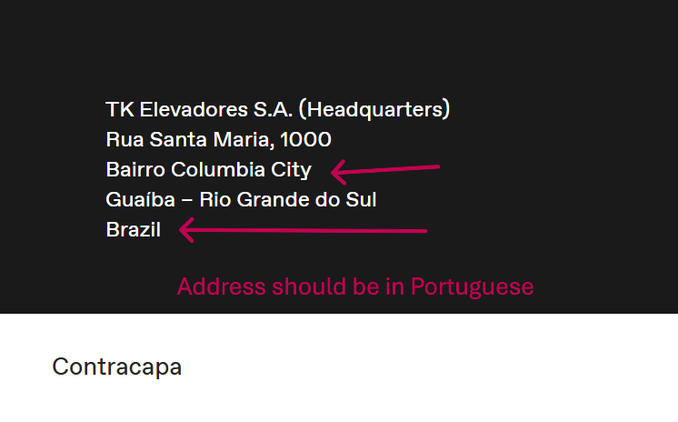
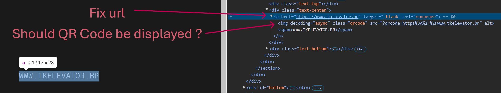

# cypress-test
Test project using Cypress to run UI tests

# Requirements
- node v23.2.0
- npm 10.9.0

# How to install
On the root folder:
>npm install

# Running the tests
Executing all test scripts:
>npm run cy:run

Executing from CI:
- In gitHub, go to Actions tab
- Select "Cypress Tests"
- Click on "Run workflow"

# Bugs and Enhancements
1) On the Cover page, button in the body could be labeled as "Etapas de configuração", so all buttons to that page have the same text.

2) On the Footer, the Next and Previous buttons are duplicated.
They are displayed when scrolling to bottom as well as when hover over the footer.

3) On the Configuration page, there is not video note on the Introduction step.
"Para obter mais informações, consulte o manual do usuário do AGILE." is missing.

4) On the Back cover page, the City and Country is written in English.
It should be in Portuguese like all other texts.

5) on the Back cover page, Click on the link does not open the company's web site.
Update link to www.tkelevator.com/pt-br

6) Update FE to avoid the <\&nbsp;\>

7) Update FE to add data-testid to buttons, links, inputs, etc.